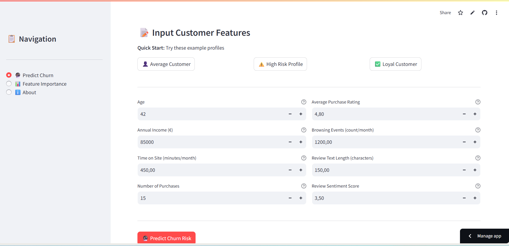
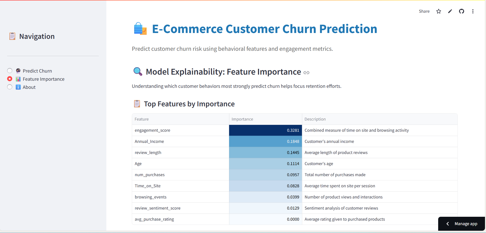
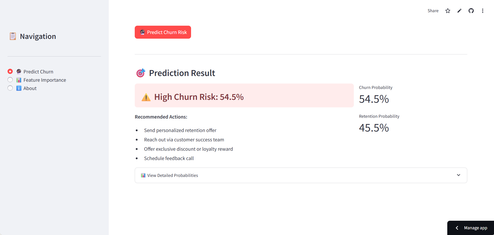

# 🛍️ E‑Commerce Customer Churn Prediction

End‑to‑end machine learning system to predict customer churn risk for e‑commerce businesses, enabling targeted retention campaigns.

[](https://ecommerce-churn-prediction-demo-woius4ern3kbjvn2vutrvq.streamlit.app/)
[](https://github.com/sarthakshivaay/ecommerce-churn-prediction-demo)
[](https://www.python.org/)
[](https://scikit-learn.org/)

---

## 📸 Demo Screenshots

### 🔮 Predict Churn – Input Form



*Quick‑start presets (Average Customer, High Risk, Loyal Customer) and business‑friendly input form.*

### 📊 Feature Importance – Model Explainability



*Top features by importance with business descriptions to explain what drives churn.*

### 🎯 Prediction Result – Risk & Actions



*Churn probability with clear risk label and concrete retention recommendations.*

---

## 🎯 Project Overview

This project demonstrates a **production‑style churn prediction pipeline** for e‑commerce businesses.

### Business Problem

E‑commerce companies often lose customers silently; by the time churn is visible in KPIs, it is too late to react. This system provides early‑warning risk scores so teams can intervene proactively.

### Solution

A machine learning system that:

- 📊 **Ingests** semi‑structured customer behavior data (purchases, browsing, reviews)
- 🔧 **Engineers** customer‑level features (engagement metrics, review sentiment)
- 🤖 **Trains** a Random Forest classifier to predict churn probability
- 🖥️ **Deploys** an interactive Streamlit dashboard for business users
- 💡 **Generates** actionable retention recommendations based on risk level

### Key Capabilities

- ✅ **Probability‑based risk scoring** – confidence scores, not just yes/no
- ✅ **Preset customer profiles** – Average, High Risk, Loyal customer templates
- ✅ **Actionable insights** – specific retention strategies for high‑risk customers
- ✅ **Model transparency** – feature importance analysis for interpretability
- ✅ **Business‑friendly UI** – usable by non‑technical stakeholders
- ✅ **Cloud deployment** – public demo via Streamlit Cloud

---

## 🏗️ Technical Architecture

```
┌─────────────────────────────────────────────────────────────┐
│ Raw Data (Kaggle CSV)                                       │
│ Customer interactions, purchases, reviews                   │
└────────────────────────┬────────────────────────────────────┘
                         │
                         ▼
┌─────────────────────────────────────────────────────────────┐
│ Data Pipeline (src/data_pipeline.py)                        │
│ - Clean & normalize data                                    │
│ - Parse text fields into numeric features                   │
│ - Aggregate to customer-level                               │
│ - Engineer engagement_score                                 │
│ - Create synthetic churn labels                             │
└────────────────────────┬────────────────────────────────────┘
                         │
                         ▼
┌─────────────────────────────────────────────────────────────┐
│ Model Training (src/model.py)                               │
│ - StandardScaler for feature normalization                  │
│ - RandomForestClassifier (100 trees)                        │
│ - Save model + scaler + feature names                       │
└────────────────────────┬────────────────────────────────────┘
                         │
                         ▼
┌─────────────────────────────────────────────────────────────┐
│ Streamlit Dashboard (streamlit_app.py)                      │
│ - Interactive prediction interface                          │
│ - Feature importance visualization                          │
│ - Documentation & insights                                  │
└─────────────────────────────────────────────────────────────┘
```

---

## 📁 Project Structure

```
ecommerce-churn-prediction/
├── data/
│   ├── raw/                      # Original Kaggle dataset
│   │   └── ecommerce_customer_behaviour_data.csv
│   └── processed/                # Cleaned, aggregated data
│       └── churn_cleaned.csv
│
├── models/
│   └── churn_model.pkl           # Trained model + scaler + features
│
├── notebooks/
│   └── 01_exploration.py         # Quick data inspection
│
├── src/
│   ├── data_pipeline.py          # ETL + feature engineering
│   └── model.py                  # Model training & persistence
│
├── screenshots/                  # App screenshots for docs
│   ├── predict_page.png
│   ├── prediction_result.png
│   └── feature_importance.png
│
├── streamlit_app.py              # Main dashboard application
├── test_app.py                   # Minimal app for testing
├── requirements.txt              # Python dependencies
├── .gitignore                    # Git ignore rules
└── README.md                     # This file
```

---

## 🚀 Quick Start

### Prerequisites

- Python 3.12 or higher
- `pip` package manager
- Git (for cloning)

### Installation

```bash
# 1. Clone the repository
git clone https://github.com/sarthakshivaay/ecommerce-churn-prediction-demo.git
cd ecommerce-churn-prediction-demo

# 2. Create virtual environment (recommended)
python -m venv venv

# Activate on Windows
venv\Scripts\activate

# Activate on macOS/Linux
source venv/bin/activate

# 3. Install dependencies
pip install --upgrade pip
pip install -r requirements.txt
```

Minimal install (only core packages):

```bash
pip install streamlit pandas scikit-learn numpy matplotlib
```

---

## 📊 Data Preparation

### Step 1: Get the Dataset

1. Download the **"E‑Commerce Customer Behaviour Dataset"** from Kaggle.
2. Place the CSV at:

```
data/raw/ecommerce_customer_behaviour_data.csv
```

### Step 2: Run the Data Pipeline

```bash
python src/data_pipeline.py
```

This script:

- ✅ Cleans and normalizes columns
- ✅ Parses text fields (`Purchase_History`, `Browsing_History`, `Product_Reviews`)
- ✅ Creates numeric features: `num_purchases`, `avg_purchase_rating`, `browsing_events`, `review_length`, `review_sentiment_score`
- ✅ Aggregates interactions to one row per customer
- ✅ Engineers `engagement_score` from time on site + browsing activity
- ✅ Creates synthetic `Churn` label (1 = will churn, 0 = will not churn)
- ✅ Saves the result to `data/processed/churn_cleaned.csv`

Example console output:

```
[PIPELINE] Loading raw data...
[INFO] Raw data loaded. Shape: (50, 9)
[PIPELINE] Aggregating to customer level...
[INFO] Aggregated to customer-level shape: (13, 9)
[PIPELINE] Engineering churn label...
[INFO] Synthetic 'Churn' column updated. Churn rate: 0.38
```

---

## 🤖 Model Training

```bash
python src/model.py
```

This script:

- ✅ Loads `data/processed/churn_cleaned.csv`
- ✅ Splits features `X` and target `y = Churn`
- ✅ Applies `StandardScaler` to numeric features
- ✅ Trains `RandomForestClassifier` (100 estimators, `random_state=42`)
- ✅ Saves the trained model, scaler, and feature names to `models/churn_model.pkl`

Example output:

```
[MODEL] Training Random Forest model...
[MODEL] Model trained. Accuracy: 0.92
[MODEL] Model saved to models/churn_model.pkl
```

---

## 🖥️ Run the Dashboard

### Local Development

```bash
streamlit run streamlit_app.py
```

Then open in your browser:

```
http://localhost:8501
```

### Live Demo

You can also try the deployed version here:

- 🌐 **Live App:** https://ecommerce-churn-prediction-demo-woius4ern3kbjvn2vutrvq.streamlit.app/
- 💻 **GitHub Repository:** https://github.com/sarthakshivaay/ecommerce-churn-prediction-demo

---

## 📖 Using the Dashboard

### Page 1: 🔮 Predict Churn

Quick‑start presets:

- 👤 **Average Customer** – typical user profile
- ⚠️ **High Risk Profile** – low engagement, negative sentiment
- ✅ **Loyal Customer** – high engagement, positive sentiment

Input features:

| Feature                | Description                               | Example  |
|------------------------|-------------------------------------------|----------|
| Age                    | Customer age in years                     | 35       |
| Annual Income (€)      | Yearly income                             | 60000    |
| Time on Site           | Avg minutes/month on site                 | 200      |
| Number of Purchases    | Total completed orders                    | 5        |
| Avg Purchase Rating    | Star rating (1–5)                         | 4.0      |
| Browsing Events        | Product views/clicks per month            | 500      |
| Review Text Length     | Avg characters in reviews                 | 80       |
| Review Sentiment Score | Sentiment score (−10 to +10)              | 1.0      |

Prediction output:

- 🎯 **Risk Level:** High Churn Risk / Low Churn Risk
- 📊 **Probability:** churn and retention probabilities (0–100%)
- 💡 **Recommendations:** specific retention actions for high‑risk customers

Example high‑risk recommendations:

- Send personalized retention offer
- Reach out via customer success team
- Offer exclusive discount or loyalty reward
- Schedule feedback call

### Page 2: 📊 Feature Importance

Shows:

- Ranked table of all features by importance
- Highlighted top drivers of churn (e.g. `engagement_score`, `Annual_Income`, `review_length`)
- Business interpretation for each feature

Example business insight:

> If `engagement_score` is the top feature, low engagement is the strongest churn signal → focus on re‑engagement campaigns.

### Page 3: ℹ️ About

- Project overview and objectives
- Tech stack details
- Model limitations and disclaimers
- Future extension ideas

---

## 🛠️ Tech Stack

| Component      | Technology             | Purpose                         |
|----------------|------------------------|---------------------------------|
| Language       | Python 3.12            | Core development                |
| ML Framework   | scikit‑learn           | Model training & inference      |
| Data Processing| pandas, numpy          | Data manipulation               |
| Visualization  | matplotlib             | Charts & plots                  |
| Web Framework  | Streamlit              | Interactive dashboard           |
| Deployment     | Streamlit Cloud        | Hosting & CI/CD                 |
| Version Control| Git, GitHub            | Code management                 |

---

## 🧠 Model Details

**Algorithm**

- Random Forest classifier
- 100 decision trees, `random_state=42`
- Handles non‑linear relationships and provides feature importance

**Features (9 total)**

- `Age` – customer age
- `Annual_Income` – yearly income
- `Time_on_Site` – average time spent on site
- `num_purchases` – total orders completed
- `avg_purchase_rating` – average product rating
- `browsing_events` – monthly interactions (views/clicks)
- `review_length` – average length of reviews
- `review_sentiment_score` – sentiment score (−10 to +10)
- `engagement_score` – engineered engagement metric

**Target Variable**

- `Churn` (binary)
  - `1` = customer predicted to churn
  - `0` = customer predicted to stay

**Training Setup**

- Synthetic churn labels based on engagement + sentiment thresholds
- StandardScaler on all numeric features
- No hyperparameter tuning (baseline model)

---

## ⚠️ Limitations & Disclaimers

This is a **demonstration project**, not a production system.

**Data limitations**

- ❗ Churn labels are synthetic, derived from rules, not actual historical churn
- ❗ Small dataset after aggregation (13 customers from 50 raw interactions)
- ❗ No temporal validation (no time‑based split)

**Model limitations**

- ❗ Default Random Forest parameters, no tuning
- ❗ Probabilities not calibrated
- ❗ No model or data drift monitoring

**For real production use, you would need:**

- ✅ True churn labels (e.g. no purchase in 90 days)
- ✅ Larger datasets with thousands of customers
- ✅ Proper validation (train/validation/test, cross‑validation)
- ✅ Probability calibration (Platt scaling or isotonic regression)
- ✅ A/B tests for retention campaigns
- ✅ Monitoring + alerting for drift
- ✅ Integration with CRM (Salesforce, HubSpot, etc.)

---

## 🚀 Future Extensions

**Data & Features**

- Use real transaction logs with real churn labels
- Add time‑series features (engagement trends over 3/6/12 months)
- Include customer support interactions and marketing channels
- Add product category preferences

**Model Improvements**

- Try XGBoost / LightGBM
- Hyperparameter tuning (GridSearchCV, Optuna)
- Calibrated probabilities
- SHAP values for local explanations

**Dashboard Enhancements**

- Customer segmentation (e.g. k‑means clusters)
- Historical churn trends and cohort analysis
- ROI calculator for retention campaigns
- Bulk CSV upload for batch scoring

**Integration & Deployment**

- REST API with FastAPI for programmatic access
- Webhooks to CRM when high‑risk customers are detected
- Email alerts for customer success team
- Docker containerization and Kubernetes deployment
- CI/CD pipeline with GitHub Actions

---

## 🔗 Links & Resources

- 🌐 **Live Streamlit App:** https://ecommerce-churn-prediction-demo-woius4ern3kbjvn2vutrvq.streamlit.app/
- 💻 **GitHub Repository:** https://github.com/sarthakshivaay/ecommerce-churn-prediction-demo

Created by **Sarthak Tyagi**, January 2026.
